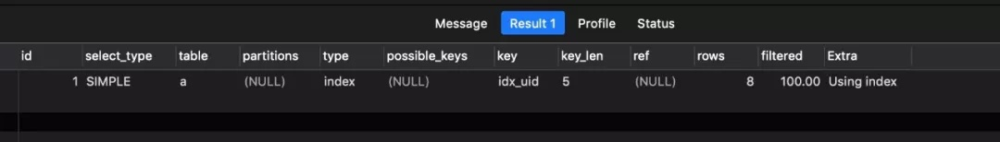
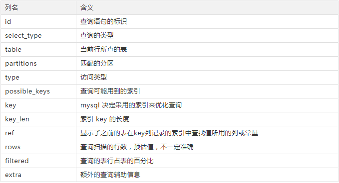

# 索引

## InnoDB 的索引模型

在 InnoDB 中，表都是根据主键顺序以索引的形式存放的，这种存储方式的表称为索引组织表。InnoDB 使用了 B+ 树索引模型，所以数据都是存储在 B+ 树中的。

每一个索引在 InnoDB 里面对应一棵 B+ 树。

假设，我们有一个主键列为 ID 的表，表中有字段 k，并且在 k 上有索引。这个表的建表语句是：

```sql
mysql> create table T(
id int primary key,
k int not null,
name varchar(16),
index (k)
)engine=InnoDB;
```


表中 R1~R5 的 (ID,k) 值分别为 (100,1)、(200,2)、(300,3)、(500,5) 和 (600,6)。

> 主键索引的叶子节点存的是整行数据。在 InnoDB 里，主键索引也被称为聚簇索引（clustered index）。
>
> 非主键索引的叶子节点内容是主键的值。在 InnoDB 里，非主键索引也被称为二级索引（secondary index）。

根据上面的索引结构说明，我们来讨论一个问题：基于主键索引和普通索引的查询有什么区别？

- 如果语句是 `select * from T where ID=500`，即主键查询方式，则只需要搜索 ID 这棵 B+ 树；
- 如果语句是 `select * from T where k=5`，即普通索引查询方式，则需要先搜索 k 索引树，得到 ID 的值为 500，再到 ID 索引树搜索一次。这个过程称为回表。

也就是说，基于非主键索引的查询需要多扫描一棵索引树。因此，我们在应用中应该尽量使用主键查询。

## 索引维护

B+ 树为了维护索引有序性，在插入新值的时候需要做必要的维护。

除了性能外，页分裂操作还影响数据页的利用率。原本放在一个页的数据，现在分到两个页中，整体空间利用率降低大约 50%。当然有分裂就有合并。

当相邻两个页由于删除了数据，利用率很低之后，会将数据页做合并。合并的过程，可以认为是分裂过程的逆过程。

自增主键是指自增列上定义的主键，在建表语句中一般是这么定义的： NOT NULL PRIMARY KEY AUTO_INCREMENT。插入新记录的时候可以不指定 ID 的值，系统会获取当前 ID 最大值加 1 作为下一条记录的 ID 值。

假设你的表中确实有一个唯一字段，比如字符串类型的身份证号，那应该用身份证号做主键，还是用自增字段做主键呢？由于每个非主键索引的叶子节点上都是主键的值。如果用身份证号做主键，那么每个二级索引的叶子节点占用约 20 个字节，而如果用整型做主键，则只要 4 个字节，如果是长整型（bigint）则是 8 个字节。

显然，主键长度越小，普通索引的叶子节点就越小，普通索引占用的空间也就越小。

## 覆盖索引

> 执行的语句`select * from T where k between 3 and 5`
>
> 执行的语句`select ID from T where k between 3 and 5`

**由于覆盖索引可以减少树的搜索次数，显著提升查询性能，所以使用覆盖索引是一个常用的性能优化手段。**

## 最左前缀原则

**B+ 树这种索引结构，可以利用索引的“最左前缀”，来定位记录。**

这个最左前缀可以是联合索引的最左 N 个字段，也可以是字符串索引的最左 M 个字符。

在建立联合索引的时候，如何安排索引内的字段顺序。
这里一般的评估标准是，索引的复用能力。因为可以支持最左前缀，所以当已经有了 (a,b) 这个联合索引后，一般就不需要单独在 a 上建立索引了。因此，第一原则是，如果通过调整顺序，可以少维护一个索引，那么这个顺序往往就是需要优先考虑采用的。

那么，如果既有联合查询，又有基于 a、b 各自的查询呢？查询条件里面只有 b 的语句，是无法使用 (a,b) 这个联合索引的，这时候你不得不维护另外一个索引，也就是说你需要同时维护 (a,b)、(b) 这两个索引。这时候，我们要考虑的原则就是空间了。

比如上面这个市民表的情况，name 字段是比 age 字段大的 ，那我就建议你创建一个（name,age) 的联合索引和一个 (age) 的单字段索引。

## Explain 的使用

在 SQL 语句前面加上 explain，如：EXPLAIN SELECT \* FROM a;



### Explain 输出的字段内容



1. id: 是用来顺序标识整个查询中 select 语句的，在嵌套查询中 id 越大的语句越先执行
2. select_type:
   - simple: 简单的 SELECT（不使用 UNION 或子查询）
   - primary: 最外面的 SELECT•union: UNION 中的第二个或更高的 SELECT 语句
   - dependent union: UNION 中的第二个或更高的 SELECT 语句，取决于外部查询
   - union result: UNION 的结果
   - subquery: 在子查询中首先选择 SELECT
   - dependent subquery: 子查询中的第一个 SELECT，取决于外部查询•derived: 派生表——该临时表是从子查询派生出来的，位于 from 中的子查询
   - uncacheable subquery: 无法缓存结果的子查询，必须为外部查询的每一行重新计算
   - uncacheable union: 在 UNION 中的第二个或更晚的选择属于不可缓存的子查询
3. table: 每一行引用的表名
4. type: 从上到下效果依次降低
   - system: const 的一种特例，表中只有一行数据
   - const: 当确定最多只会有一行匹配的时候，MySQL 优化器会在查询前读取它而且只读取一次，因此非常快。使用主键查询往往就是 const 级别的，非常高效
   - eq_ref: 最多只返回一条符合条件的记录，通过使用在两个表有关联字段的时候
   - ref: 通过普通索引查询匹配的很多行时的类型
   - fulltext: 全文索引
   - ref_or_null: 跟 ref 类似的效果，不过多一个列不能 null 的条件
   - index_merge: 此连接类型表示使用了索引合并优化。在这种情况下，输出行中的 key 列包含使用的索引列表，key_len 包含所用索引的最长 key 部分列表
   - unique_subquery: 在使用 in 查询的情况下会取代 eq_ref
   - range: 范围扫描，一个有限制的索引扫描。key 列显示使用了哪个索引。当使用=、 <>、>、>=、<、<=、IS NULL、<=>、BETWEEN 或者 IN 操作符，用常量比较关键字列时,可以使用 range
   - index: 类似全表扫描，只是扫描表的时候按照索引次序进行而不是行。主要优点就是避免了排序, 但是开销仍然非常大。如在 Extra 列看到 Using index，说明正在使用覆盖索引，只扫描索引的数据，它比按索引次序全表扫描的开销要小很多
   - ALL: 全表扫描
5. possible_key: MySQL 可能采用的索引，但是并不一定使用
6. key: MySQL 正真使用的索引名称
7. rows: 预估的扫描行数，只能参考不准确
8. extra: 该列包含了很多额外的信息，包括是否文件排序，是否有临时表等，很多时候这个字段很有用能提供很多信息

## 项目中常用的 MySQL 优化方法

- SQL 语句中 IN 包含的值不应过多

  MySQL 对于 IN 做了相应的优化，即将 IN 中的常量全部存储在一个数组里面，而且这个数组是排好序的。但是如果数值较多，产生的消耗也是比较大的。再例如：select id from t where num in(1,2,3) 对于连续的数值，能用 between 就不要用 in 了；再或者使用连接来替换。

- SELECT 语句务必指明字段名称

  SELECT\*增加很多不必要的消耗（CPU、IO、内存、网络带宽）；增加了使用覆盖索引的可能性；当表结构发生改变时，前断也需要更新。所以要求直接在 select 后面接上字段名。

- 当只需要一条数据的时候，使用 limit 1

  这是为了使 EXPLAIN 中 type 列达到 const 类型

- 如果排序字段没有用到索引，就尽量少排序

- 如果限制条件中其他字段没有索引，尽量少用 or

  or 两边的字段中，如果有一个不是索引字段，而其他条件也不是索引字段，会造成该查询不走索引的情况。很多时候使用 union all 或者是 union（必要的时候）的方式来代替“or”会得到更好的效果。

- 尽量用 union all 代替 union

  union 和 union all 的差异主要是前者需要将结果集合并后再进行唯一性过滤操作，这就会涉及到排序，增加大量的 CPU 运算，加大资源消耗及延迟。当然，union all 的前提条件是两个结果集没有重复数据。

- 区分 in 和 exists、not in 和 not exists

  区分 in 和 exists 主要是造成了驱动顺序的改变（这是性能变化的关键），如果是 exists，那么以外层表为驱动表，先被访问，如果是 IN，那么先执行子查询。所以 IN 适合于外表大而内表小的情况；EXISTS 适合于外表小而内表大的情况。

  关于 not in 和 not exists，推荐使用 not exists

- 避免在 where 子句中对字段进行表达式操作

- 避免隐式类型转换

  where 子句中出现 column 字段的类型和传入的参数类型不一致的时候发生的类型转换，建议先确定 where 中的参数类型。

- 对于联合索引来说，要遵守最左前缀法则

  举列来说索引含有字段 id、name、school，可以直接用 id 字段，也可以 id、name 这样的顺序，但是 name;school 都无法使用这个索引。所以在创建联合索引的时候一定要注意索引字段顺序，常用的查询字段放在最前面。

- 不建议使用%前缀模糊查询

- 注意范围查询语句

  对于联合索引来说，如果存在范围查询，比如 between、>、<等条件时，会造成后面的索引字段失效。

- 关于 JOIN 优化
  - LEFT JOIN A 表为驱动表，INNER JOIN MySQL 会自动找出那个数据少的表作用驱动表(STRAIGHT_JOIN)，RIGHT JOIN B 表为驱动表。
  - 利用小表去驱动大表
  - 尽量使用 inner join，避免 left join
